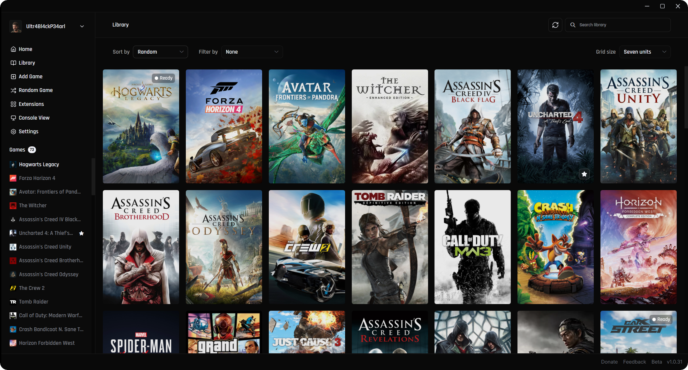
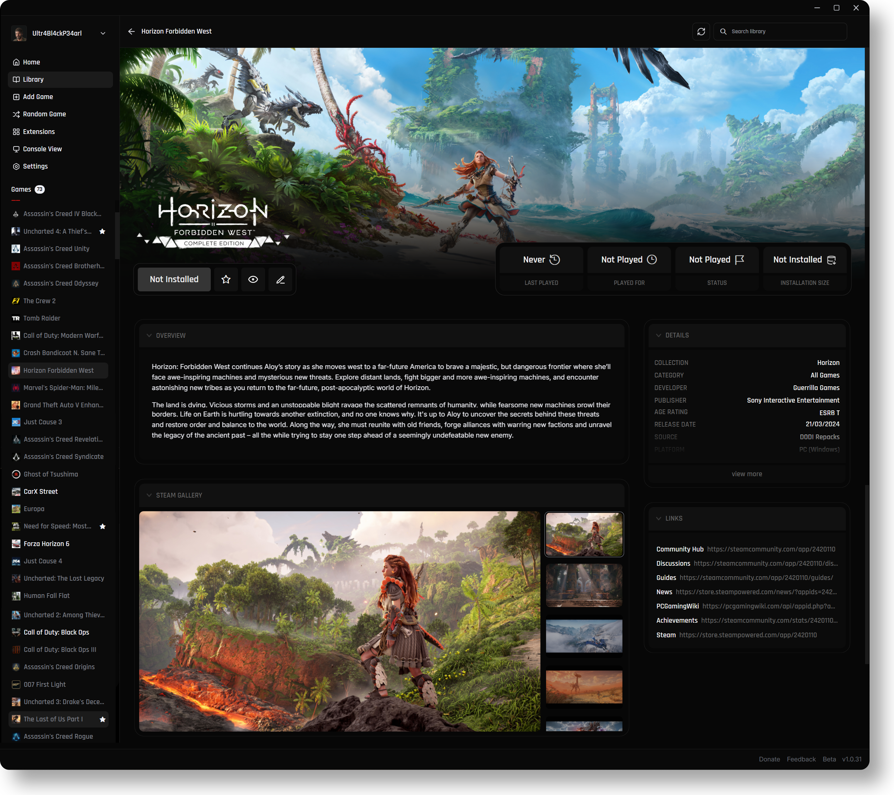

<p align="center">
  
</p>

<h1 align="center">OSIRIS LAUNCHER</h1>

Osiris is a game launcher build on top of [Playnite](https://github.com/JosefNemec/Playnite), but redesigned completely to elevate the experience to a more efficient and beautiful level. It allows you to host all your games in one single library and add to them as much information, details and statistics as it exists. Osiris is focused on collectors, it provides the ability to host and manage big game libraries and provide various functionalities to improve the overall gaming experience. Its currently build and maintained by one single developer.

<p align="center">
  
</p>

<p align="center">
  
</p>

## Download

Download the latest prerelease from the
[GitHub Releases](https://github.com/numinainitiative/Osiris_Launcher/releases)
page.

Use the ZIP package named:

```text
Osiris-<version>-win-x64.zip
```

Do not use GitHub's automatically generated source-code archives; they are not
runnable Osiris packages.

See [Installation](docs/INSTALL.md) for checksum verification and setup notes.

## Support

If you like Osiris, you can provide your support and help keep its development and maintenance going, thanks.

<div align="center">
  <a href="https://www.patreon.com/OsirisLauncher">
    <br>
    <strong>Support Osiris on Patreon</strong>
  </a>
</div>

## Status

Osiris is currently in Beta. Prerelease packages are portable and unsigned while
code signing is being completed.

## License

Osiris is released under the [MIT License](LICENSE). Third-party runtime notices
are listed in [THIRD-PARTY-NOTICES.md](THIRD-PARTY-NOTICES.md).
